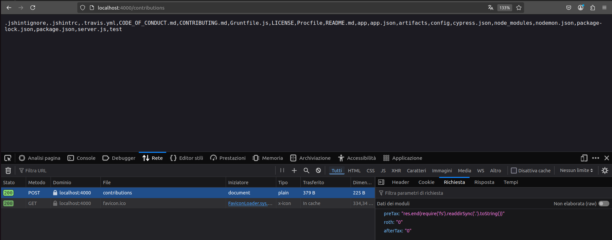
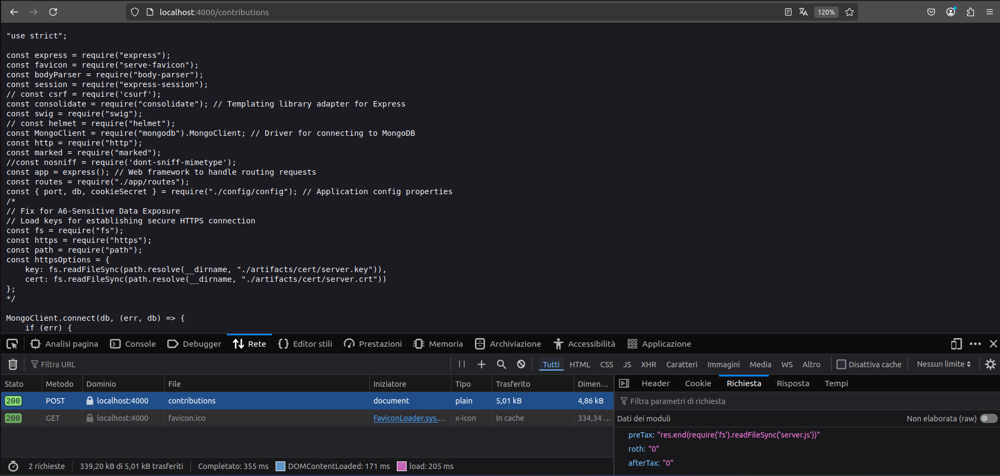
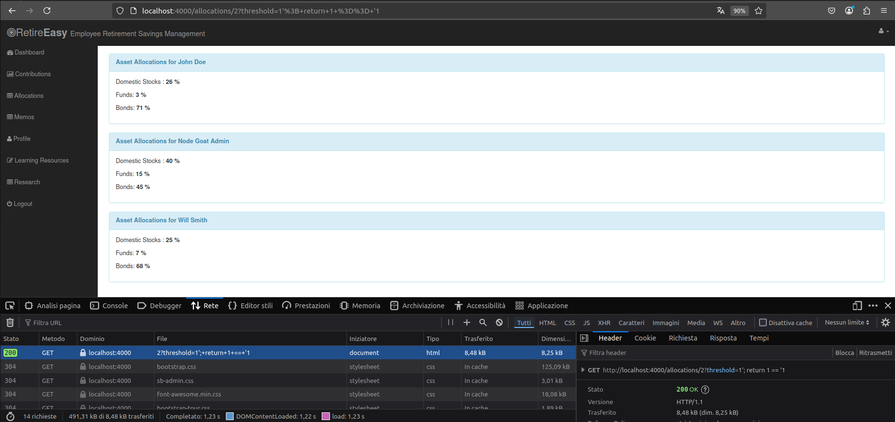

# A1 - Injection

## A1 - 1 Server Side JS Injection 
Quando una funzione come  `eval()` è usata per elaborare gli input forniti dall'utente, può essere sfruttate da un attaccante per iniettare ed  eseguire codice JavaScript dannoso sul server.

### File System Access

In `routes/contributions.js`, la funzione `handleContributionsUpdate()` utilizza in modo insicuro `eval()` per convertire in numeri interi gli importi dei contributi forniti dall'utente.
``` js
// Insecure use of eval() to parse inputs
var preTax = eval(req.body.preTax);
var afterTax = eval(req.body.afterTax);
var roth = eval(req.body.roth); 
```

Questa vulnerabilità può essere sfruttata da un attaccante per accedere al File System:

💡 **Spiegazione**
`res.end(require('fs').readdirSync('.').toString())`:
- `require('fs')`: importa il modulo `fs` di Node.js, che permette di lavorare con il filesystem.

- `readdirSync('.')`: usa la funzione sincrona `readdirSync` per leggere il contenuto della cartella corrente (`'.'`). Questa funzione ritorna un array con i nomi dei file e delle cartelle presenti nella directory.

- `.toString()`: converte l'array risultante in una stringa, separando gli elementi con delle virgole.

- `res.end(...)`: termina la risposta HTTP e invia la stringa risultante come corpo della risposta. 

dopo essere riuscito a visualizzare tutti i file presenti nella directory corrente, l'attaccante può anche visualizzarne il contenuto:

💡 **Spiegazione** `res.end(require('fs').readFileSync(filename))`:
- `require('fs')`: importa il modulo `fs` di Node.js, che permette di lavorare con il filesystem.

- `readFileSync(filename)`: legge in modo sincrono il contenuto del file specificato dalla variabile `filename`. Ritorna un buffer contenente i dati del file.

- `res.end(...)` : termina la risposta HTTP e invia il contenuto del file come corpo della risposta.

### Denial of Service Attack

Questa stessa vulnerabilità può essere usata da un attaccante anche per eseguire un attacco DoS. Infatti, inserendo nel campo del form la stringa `process.kill(process.pid)`, il processo che esegue il server viene ucciso rendendo il servizio non più disponibile. 

#### 🛡️ Mitigation
```js 
var preTax = parseInt(req.body.preTax);
var afterTax = parseInt(req.body.afterTax);
var roth = parseInt(req.body.roth); 
```
💡 **Spiegazione**:
- ❌ `eval()` è pericoloso perché esegue qualsiasi codice JavaScript passato come stringa.

- ✅ `parseInt()` è più sicuro perché interpreta solo numeri: se l’input è qualcosa di non numerico, il risultato sarà NaN.

##  A1 - 2 SQL and NoSQL Injection 
SQL Injection e NoSQL Injection si verificano quando un attaccante inserisce dati malevoli in input non filtrati per manipolare query o comandi del database, compromettendo sicurezza e integrità dei dati.

### NoSQL Injection
In `routes/allocations.js` viene invocata la funzione `getByUserIdAndThreshold` (definita in `data/allocations-dao.js`). 
Questa funzione esegue una query senza sanificare l'input `threshold`:
```js
this.getByUserIdAndThreshold = (userId, threshold, callback) => {
        const parsedUserId = parseInt(userId);

        const searchCriteria = () => {

            if (threshold) {
                return {
                    $where: `this.userId == ${parsedUserId} && this.stocks > '${threshold}'`
                };
            }
            return {
                userId: parsedUserId
            };
        };

        allocationsCol.find(searchCriteria()).toArray((err, allocations) => {
            if (err) return callback(err, null);
            if (!allocations.length) return callback("ERROR: No allocations found for the user", null);

            let doneCounter = 0;
            const userAllocations = [];

            allocations.forEach( alloc => {
                userDAO.getUserById(alloc.userId, (err, user) => {
                    if (err) return callback(err, null);

                    alloc.userName = user.userName;
                    alloc.firstName = user.firstName;
                    alloc.lastName = user.lastName;

                    doneCounter += 1;
                    userAllocations.push(alloc);

                    if (doneCounter === allocations.length) {
                        callback(null, userAllocations);
                    }
                });
            });
        });
    };
```

Questa vulnerabilità può essere sfruttata da un attaccante per accedere a tutte le allocations presenti nel database:

💡 **Spiegazione**: 
inserendo `1'; return 1 == '1` nel campo `threshold` non sanificato, la query risultante diventa
```js
this.userId == 2 && this.stocks > '1'; return 1 == '1'
```
il `;` 'spezza' la condizione e quindi la prima parte viene valutata ma non influenza il risultato mentre il `return 1 == '1'` restituisce sempre `true` e di conseguenza la condizione sarà vera per ogni documento. Quindi, dato che MongoDB verifica questa condizione per ogni documento, tutti i documenti saranno inclusi nel risultato.

#### 🛡️ Mitigation
```js
const searchCriteria = () => {

    if (threshold) {                         
        const parsedThreshold = parseInt(threshold, 10);
        
        if (parsedThreshold >= 0 && parsedThreshold <= 99) {
            return {$where: `this.userId == ${parsedUserId} && this.stocks > ${parsedThreshold}`};
        }
        throw `The user supplied threshold: ${parsedThreshold} was not valid.`;
    }
    return {
        userId: parsedUserId
    };
};
```
💡 **Spiegazione**:
- ✅ **Sanitizza l’input**: usa `parseInt(threshold, 10)` per convertire threshold in un numero intero usando la base 10. Se l’input è malevolo (es. "1'; return 1 == '1"), `parseInt` restituisce solo il numero iniziale (1) e ignora il resto, impedendo l'iniezione di codice.
- ✅ **Valida il range**: accetta solo valori tra 0 e 99. Se l’input è fuori da questo intervallo (o non è un numero), lancia un errore e non costruisce nessuna query pericolosa.


[🔙](01-as-is.md#a1---injection)
