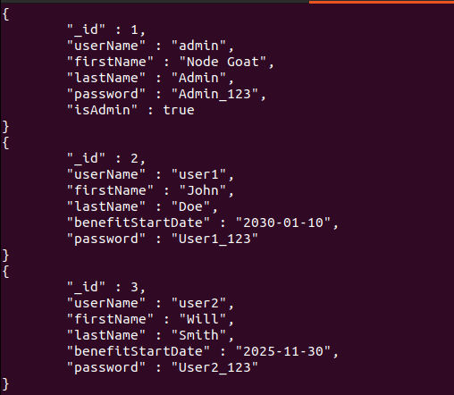
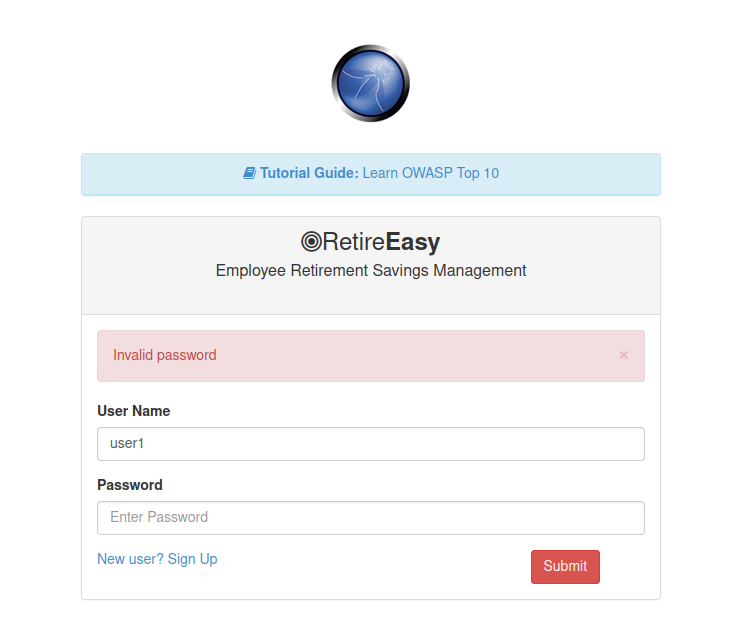

# A2 - Broken Authentication and Session Management 

## A2 - 1 Session Management 
Una gestione errata della sessione può consentire a un attaccante di dirottare la sessione di un utente legittimo, compromettendo la riservatezza e l'integrità dell'applicazione. Gli sviluppatori devono quindi occuparsi della protezione dell'id di sessione, dell'archiviazione sicura delle credenziali utente, della durata della sessione e della protezione dei dati critici in transito relativi alla sessione.

### Proteggere le credenziali dell'utente
In `data/user-dao.js` la funzione `addUser()` salva la password in chiaro nel database: 
```js
// Create user document
var user = {
    userName: userName,
    firstName: firstName,
    lastName: lastName,
    password: password //received from request param
};
```
se un attaccante riesce ad avere accesso al database può leggere le password degli utenti.


#### 🛡️ Mitigation
```js 
// Generate password hash
var salt = bcrypt.genSaltSync();
var passwordHash = bcrypt.hashSync(password, salt);

// Create user document
var user = {
    userName: userName,
    firstName: firstName,
    lastName: lastName,
    password: passwordHash
};
```
💡 **Spiegazione**:
- ✅ L'hash della password non può essere decifrato quindi è più sicuro.
- Quando l'utente fa il login, per verificare che la password è corretta bisogna convertirla in hash e confrontare l'hash risultante con quello salvato nel database:
```js
if (bcrypt.compareSync(password, user.password)) {
    callback(null, user);
} else {
    callback(invalidPasswordError, null);
}
      
```

### Session Hijacking
In `routes/session.js` la funzione `handleLoginRequest()` non genera un nuovo id di sessione quando l'utente esegue l'accesso.
```js
this.handleLoginRequest = (req, res, next) => {
    const {userName, password} = req.body;
        userDAO.validateLogin(userName, password, (err, user) => {
            const invalidUserNameErrorMessage = "Invalid username";
            const invalidPasswordErrorMessage = "Invalid password";
            if (err) {
                if (err.noSuchUser) {
                    console.log("Error: attempt to login with invalid user: ", userName); 

                    return res.render("login", {
                        userName: userName,
                        password: "",
                        loginError: invalidUserNameErrorMessage,
                        environmentalScripts
                    });
                } else if (err.invalidPassword) {
                    return res.render("login", {
                        userName: userName,
                        password: "",
                        loginError: invalidPasswordErrorMessage,
                        environmentalScripts
                    });
                } else {
                    return next(err);
                }
            }

            req.session.userId = user._id;
            return res.redirect(user.isAdmin ? "/benefits" : "/dashboard");
        });
    };
```

Un attaccante può sfruttare questa vulnerabilità provando a rubare il cookie con l'id di sessione e utilizzandolo per accedere all'applicazione senza dover inserire username e password.

#### 🛡️ Mitigation
```js 
req.session.regenerate(function() {

    req.session.userId = user._id;
    return res.redirect(user.isAdmin ? "/benefits" : "/dashboard");
})
```
💡 **Spiegazione**:
- ✅ in questo modo viene generato un nuovo session id ogni volta che l'utente esegue l'accesso.

## A2 - 2 Password Guessing Attack
Se la password non soddisfa dei requisiti minimi di lunghezza e complessità, un attaccante può eseguire un attacco brute force per password guessing oppure utilizzare tool per la generazione di password casuali.

### Password length and complexity
In `routes/session.js` la funzione `validateSignup()` utilizza un regex troppo semplice
```js
var PASS_RE = /^.{1,20}$/;
```
#### 🛡️ Mitigation
```js 
var PASS_RE =/^(?=.*\d)(?=.*[a-z])(?=.*[A-Z]).{8,}$/;
```
💡 **Spiegazione**:
- ✅ questo regex richiede che la password sia lunga almeno 8 caratteri e che contenga almeno un numero, una lettera minuscola e una lettera maiuscola. Quindi l'utente è costretto a fornire una password più difficile da indovinare.

### Username/Password Enumeration
In `routes/session.js` la funzione [`handleLoginRequest()`](#session-hijacking) utilizza un messaggio d'errore diverso nel caso in cui è errato lo username o la password.
Ma queste informazioni possono essere preziose per un attaccante che esegue brute forcing. 


#### 🛡️ Mitigation
```js 
const errorMessage = "Invalid username and/or password";
if (err) {
                if (err.noSuchUser) {
                    console.log("Error: attempt to login with invalid user: ", userName);

                    return res.render("login", {
                        userName: userName,
                        password: "",
                        loginError: errorMessage
                        environmentalScripts
                    });
                } else if (err.invalidPassword) {
                    return res.render("login", {
                        userName: userName,
                        password: "",
                        loginError: errorMessage
                        environmentalScripts
                    });
                } else {
                    return next(err);
                }
            }
```
💡 **Spiegazione**:
- ✅ in questo modo si risolve facilmente il problema usando un messaggio di errore generico "Invalid username and/or password"


[🔙](01-as-is.md#a2---broken-authentication-and-session-management)