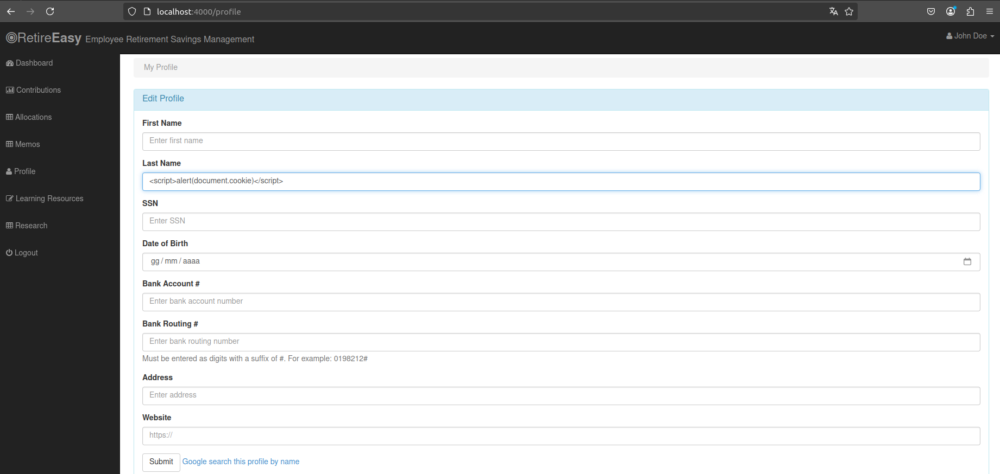
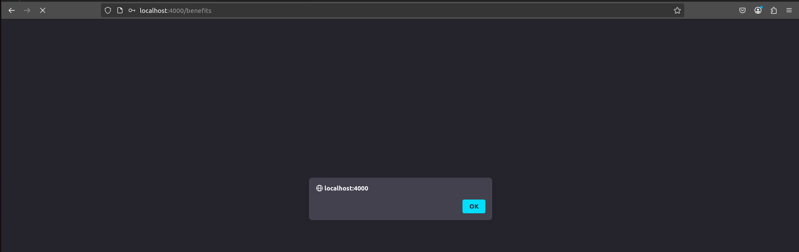
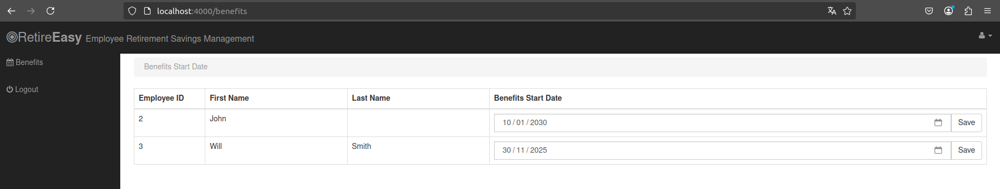
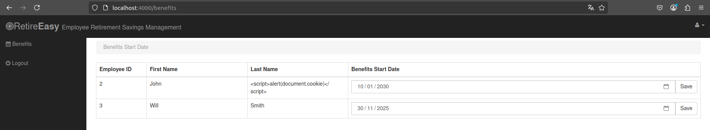

# A3 -  Cross-Site Scripting (XSS) 

Esistono due tipi di vulnerabilità XSS:
- **reflected XSS**: i dati dannosi vengono ritrasmessi dal server in risposta immediata a una richiesta HTTP della vittima
- **stored XSS**: i dati dannosi vengono memorizzati sul server e successivamente vengono incorporati nella pagina HTML fornita alla vittima 

### Stored XSS

Il form nella sezione `profile` dell'applicazione è vulnerabile a stored XSS. Quando si invia il modulo, i valori dei campi nome e cognome vengono inviati al server e, senza alcuna convalida, vengono salvati nel database. Questi valori sono poi rinviati al browser senza un corretto escape. 

Un attaccante può modificare il suo profilo inserendo uno script malevolo come ad esempio `<script>alert(document.cookie)</script>`


Quando admin accede al suo profilo personale, lo script malevolo sarà eseguito perché la pagina di 
default dell'admin mostra le informazioni degli altri utenti.

Il campo last name dell'utente John appare vuoto perché contiene lo script.


#### 🛡️ Mitigation
```js
    swig.setDefaults({
        // Autoescape enabled
        autoescape: true
    });
```
💡 **Spiegazione**:
- ✅Abilita l'escaping automatico del contenuto in output e quindi trasforma caratteri speciali HTML in entità sicure


#### 🛡️ Mitigation 2
```js
// Enable session management using express middleware
app.use(session({
    secret: cookieSecret,
    cookie: {
        httpOnly: true,
        secure: true
    }
}));
```
💡 **Spiegazione**:
- ✅Imposta il flag HTTPOnly ai session cookie proteggendoli dall'accesso tramite JavaScript. 


<!--[🔙](01-as-is.md#a3---cross-site-scripting-xss)-->
[🔙](../README.md#a3---cross-site-scripting-xss)