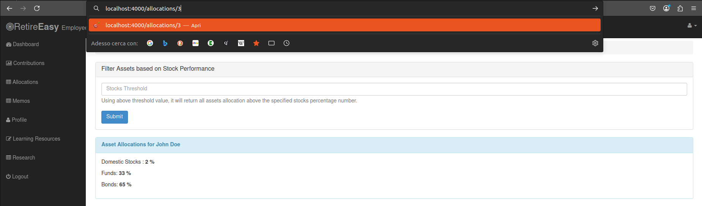
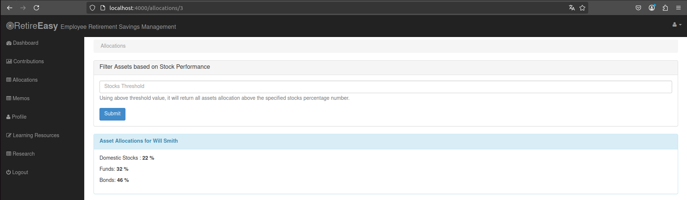

# A4 - Insecure Direct Object References 

In `routes/allocations.js` l'applicazione prende l'id utente dall'url per recuperare le allocazioni.
```js
this.displayAllocations = (req, res, next) => {
    const { userId } = req.params;
    const { threshold } = req.query;

    allocationsDAO.getByUserIdAndThreshold(userId, threshold, (err, allocations) => {
        if (err) return next(err);
        return res.render("allocations", {
            userId,
            allocations,
            environmentalScripts
        });
    });
};
          
```

Se un utente malevolo (ad esmpio John Doe - id:2) modifica l'url usando l'id di un altro utente (ad esempio 3)

riesce ad accedere alle allocazioni dell'utente con id 3


#### 🛡️ Mitigation

```js
this.displayAllocations = (req, res, next) => {
    const { userId } = req.session; // take user id from session instead of from URL param
    const { threshold } = req.query;

    allocationsDAO.getByUserIdAndThreshold(userId, threshold, (err, allocations) => {
        if (err) return next(err);
        return res.render("allocations", {
            userId,
            allocations,
            environmentalScripts
        });
    });
}
```
💡 **Spiegazione**:
- ✅ in questo modo le allocazioni sono recuperate a partire dall'id della sessione e non dal parametro dell'url

accesso eseguito con pippo (id = 4). Quando si inserisce nell'url un altro id, restituisce comunque le allocazioni di pippo (perché prende l'id dalla sessione)


<!--[🔙](01-as-is.md#a4---insecure-direct-object-references)-->
[🔙](../README.md#a4---insecure-direct-object-references)