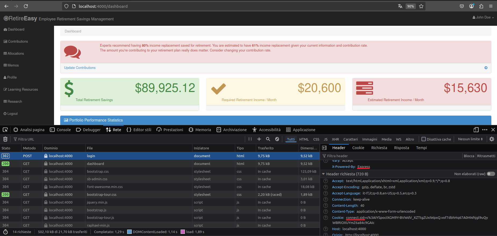

#  A5 - Security Misconfiguration

Il file `server.js` presenta una vulnerabilità di tipo Security Misconfiguration in quanto rivela dettagli implementativi interni negli header di risposta HTTP. Un attaccante può usare queste informazioni per cercare vulnerabilità specifiche per quel sistema.




#### 🛡️ Mitigation

```js
app.disable("x-powered-by"); 
```

💡 **Spiegazione**:
- ✅Disabilita l’intestazione HTTP X-Powered-By che Express invia automaticamente nelle risposte.

#### 🛡️ Mitigation 2

```js
app.use(express.session({
    secret: config.cookieSecret,
    key: "sessionId",
    cookie: {
        httpOnly: true,
        secure: true
    }
}));
```

💡 **Spiegazione**:
- ✅ Il nome di default del session cookie viene modificato impostando l'attributo key nel momento in cui si crea la sessione express.
.png)

<!--[🔙](01-as-is.md#a5---security-misconfiguration)-->
[🔙](../README.md#a5---security-misconfiguration)