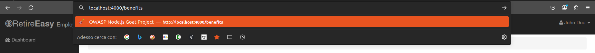
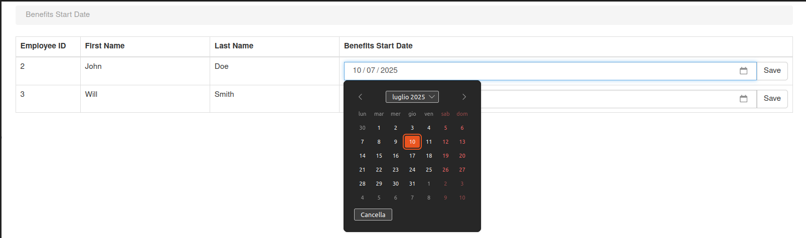

# A7 - Missing Function Level Access Control 
Nell'applicazione questa vulnerabilità è presente nel modulo `benefits`, che permette di cambiare la data di inizio del benefit per i dipendenti.

Il link a questo modulo è presente solo nel profilo dell'admin ma un utente non admin può accedervi attraverso l'url.

In `routes/index.js` non c'è nessun tipo di controllo dell'autorizzazione per l'accesso alla rotta `benefits`.

```js
// Benefits Page
app.get("/benefits", isLoggedIn, benefitsHandler.displayBenefits);
app.post("/benefits", isLoggedIn, benefitsHandler.updateBenefits);
```





#### 🛡️ Mitigation
Si può mitigare aggiungendo un middleware (`isAdmin`) in `session/index.js` per verificare i ruoli dell'utente.
```js
// Benefits Page
app.get("/benefits", isLoggedIn, isAdmin, benefitsHandler.displayBenefits);
app.post("/benefits", isLoggedIn, isAdmin, benefitsHandler.updateBenefits);
```
Il middleware può essere introdotto in `session/session.js`:
```js
this.isAdminUserMiddleware = (req, res, next) => {
    if (req.session.userId) {
        return userDAO.getUserById(req.session.userId, (err, user) => {
            return user && user.isAdmin ? next() : res.redirect("/login");
        });
    }
    console.log("redirecting to login");
    return res.redirect("/login");

};
```

[🔙](01-as-is.md#a7---missing-function-level-access-control)