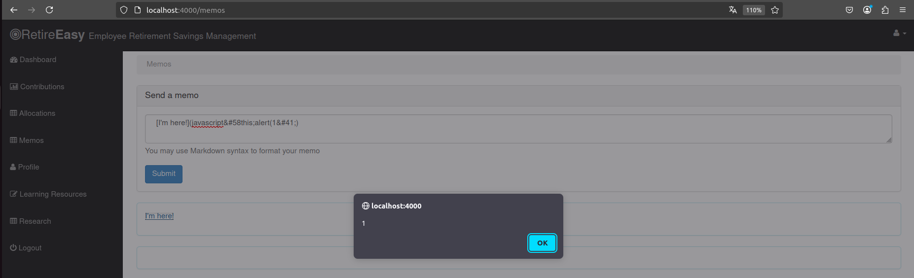
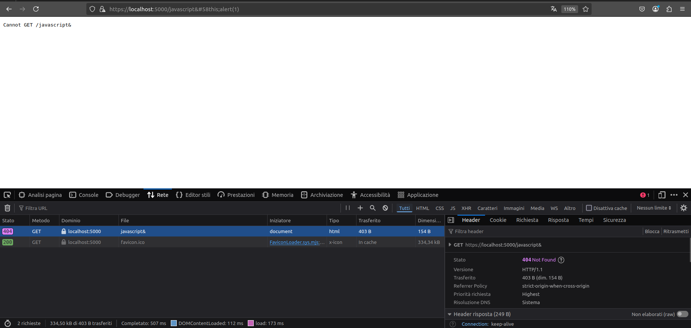

# A9 - Using Components with Known Vulnerabilities
L'applicazione usa una versione insicura della libreria Marked che è vulnerabile ad attacchi di tipo XSS.

Nella sezione `Memos`, infatti inserendo una stringa malevola `[I'm here!](javascript&#58this;alert(1&#41;)`:


#### 🛡️ Mitigation
- ✅ Usare versioni sicure delle librerie e mantenerle aggiornate.
- ✅ Filtrare l'input, in `server.js`:
```js
    const marked = require("marked");
    const sanitizeHtml = require("sanitize-html");

    function renderSafeMarkdown(input) {
    const dirty = marked.parse(input);
    return sanitizeHtml(dirty, {
        allowedTags: sanitizeHtml.defaults.allowedTags.concat(["img"]),
        allowedAttributes: {
        a: ["href", "name", "target"],
        img: ["src", "alt"]
        },
        allowedSchemes: ["http", "https", "mailto"]
    });
    }

    app.locals.marked = renderSafeMarkdown;

```
💡 **Spiegazione**:
- `renderMarkdownSafe` prende un testo input scritto in Markdown e restituisce HTML sicuro da inserire nella pagina:
    - `allowedTags`: consente solo tag HTML sicuri, più img.
    - `allowedAttributes`: permette attributi sicuri per link e immagini.
    - `allowedSchemes`: permette solo URL che iniziano con `http`, `https` o `mailto`.
        - Qualsiasi URL tipo javascript: viene rimosso.



<!--[🔙](01-as-is.md#a9---using-components-with-known-vulnerabilities)-->
[🔙](../README.md#a9---using-components-with-known-vulnerabilities)